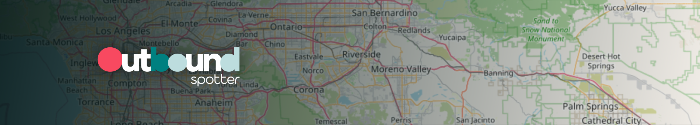
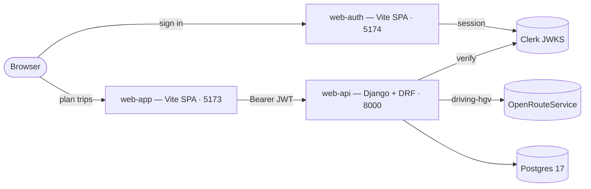

<p align="center">
  
</p>

<p align="center">
  <a href="LICENSE.md"></a>
  <a href=".github/workflows/ci.yml"></a>
  
  
  
  
  
  
  
</p>

<p align="center">
  <a href="#architecture">Architecture</a> ·
  <a href="#apps">Apps</a> ·
  <a href="#quick-start">Quick start</a> ·
  <a href="#documentation">Documentation</a> ·
  <a href="#contributing">Contributing</a> ·
  <a href="#license">License</a>
</p>

# Outbound Spotter

Trip planning for property-carrying interstate truck drivers on the 70-hour / 8-day Federal HOS schedule. Inputs current location, pickup, dropoff, and cycle hours used; outputs a routed map and a set of FMCSA §395.8-compliant Daily Log Sheets drawn as the driver would log them.

> [!NOTE]
> Outbound Spotter is **source-available** under [PolyForm Noncommercial 1.0.0](LICENSE.md) — free for personal study, education, and non-commercial research. It is not a production-deployed service, and it does not replace your motor carrier's ELD. The planner interprets the FMCSA Hours-of-Service regulations in 49 CFR §395 to the best of the spec's ability; see [the FMCSA HOS guide](docs/interstate-truck-driver-guide.md) for the law.

## What it does

- **Plans an HOS-compliant trip** from a current location → pickup → dropoff. The planner sits in `apps/web-api` and respects the 14-hour driving window, 11-hour driving limit, 30-minute break after 8 cumulative driving hours, 10 consecutive hours off, and the 70-hour / 8-day cap.
- **Routes with mandatory stops** — pickup (1 hr on-duty), dropoff (1 hr on-duty), fueling every ≤ 1 000 mi, plus the rest and sleeper periods the regulation requires. Truck-aware directions come from [OpenRouteService](https://openrouteservice.org/) `driving-hgv`, proxied server-side so the API key never reaches the browser.
- **Draws the daily log sheets.** One §395.8 24-hour grid per day of the trip — Off Duty, Sleeper Berth, Driving, On Duty (Not Driving) — with totals and Remarks (city + state at each duty change). Rendered in `apps/web-app`.
- **Exports to PDF in the browser.** Every log sheet is concatenated into one PDF entirely client-side; the API stores audit metadata only.
- **Persists per user.** Drivers can sign in (Clerk-backed auth via `apps/web-auth`), save trips, browse export history, and revisit a plan.

## Table of contents

- [Architecture](#architecture)
- [Apps](#apps)
- [Quick start](#quick-start)
- [Tech stack](#tech-stack)
- [Project layout](#project-layout)
- [Documentation](#documentation)
- [Scripts](#scripts)
- [Contributing](#contributing)
- [License](#license)
- [Acknowledgments](#acknowledgments)

## Architecture

Three apps share one Clerk instance and one Postgres database. **`web-auth`** is the only origin that renders sign-in / sign-up; it issues the Clerk session that both **`web-app`** and **`web-api`** consume. **`web-app`** is a thin trip-planner client that never calculates HOS math and never calls OpenRouteService directly. **`web-api`** owns the regulation — the Hours-of-Service planner lives there as a pure-Python module (`web_api/hos/`) with zero Django imports, and the OpenRouteService client is the only origin allowed to hold the ORS API key.

The system holds a small set of non-negotiable invariants: the HOS planner stays framework-free, the OpenRouteService key never reaches the browser, PDF rendering happens client-side only (the server stores metadata, never the bytes), and every component reads its colors and typography from the shared `@theme` tokens in `packages/ui` — no hex literals.



For the full invariant list and boundary rules, see [`context/architecture.md`](context/architecture.md).

## Apps

| Workspace                                       | Path             | Stack                                   | Port | Hosting |
| ----------------------------------------------- | ---------------- | --------------------------------------- | ---- | ------- |
| [`@outbound/web-app`](apps/web-app/README.md)   | `apps/web-app/`  | Vite 8 · React 19 · Tailwind v4         | 5173 | Vercel  |
| [`@outbound/web-auth`](apps/web-auth/README.md) | `apps/web-auth/` | Vite 8 · React 19 · Clerk Core 3        | 5174 | Vercel  |
| [`@outbound/web-api`](apps/web-api/README.md)   | `apps/web-api/`  | Django 5.2 LTS · DRF · uv · Postgres 17 | 8000 | Fly.io  |

### Shared packages

| Workspace                               | Path                          | Purpose                                                                              |
| --------------------------------------- | ----------------------------- | ------------------------------------------------------------------------------------ |
| [`@outbound/ui`](packages/ui/README.md) | `packages/ui/`                | shadcn primitives + Tailwind v4 `@theme` tokens — the single visual source of truth. |
| `@outbound/eslint-config`               | `packages/eslint-config/`     | Flat ESLint presets (`base`, `react`, `library`) with the Bulletproof zones.         |
| `@outbound/typescript-config`           | `packages/typescript-config/` | tsconfig presets (`base`, `react`, `vite-app`, `library`).                           |

## Quick start

**Prereqs.** Node 24 LTS · pnpm 11 · Python 3.13 · [uv](https://docs.astral.sh/uv/) · Postgres 17 (Docker, Homebrew, or a managed instance).

```bash
git clone https://github.com/mtohernandez/outbound-spotter.git
cd outbound-spotter
pnpm install
```

Three terminals, one per app:

```bash
pnpm --filter @outbound/web-app dev    # http://localhost:5173
```

```bash
pnpm --filter @outbound/web-auth dev   # http://localhost:5174
```

```bash
cd apps/web-api
uv sync && uv run manage.py migrate
uv run manage.py runserver             # http://localhost:8000
```

> [!IMPORTANT]
> Each app reads its own environment variables. The variable **names + types + purpose** are documented in each app's README (linked above); the **values** come from your Clerk dashboard, your OpenRouteService account, and your local Postgres. No `.env*` template is tracked in this repository.

## Tech stack

| Layer      | Tools                                                                                                             |
| ---------- | ----------------------------------------------------------------------------------------------------------------- |
| Monorepo   | Turborepo 2 · pnpm workspaces                                                                                     |
| Frontend   | React 19 · Vite 8 · TypeScript 6 · Tailwind v4 (`@theme inline`) · shadcn/ui · TanStack Query v5 · React Router 7 |
| Auth       | Clerk Core 3 (`@clerk/react`) + Clerk JWKS verification server-side                                               |
| Mapping    | Leaflet 1.9 + react-leaflet 5 · OpenRouteService (HeiGIT, free standard plan)                                     |
| PDF export | svg2pdf.js + jsPDF — entirely client-side                                                                         |
| Backend    | Django 5.2 LTS · Django REST Framework 3.17 · drf-spectacular · psycopg 3 · pydantic-settings                     |
| Database   | PostgreSQL 17                                                                                                     |
| Quality    | ESLint flat · Prettier · Ruff · mypy `--strict` · commitlint · Husky + lint-staged                                |
| Testing    | Vitest 4 + Testing Library 16 + MSW (frontend) · pytest 9 + pytest-django + factory_boy (backend)                 |
| CI / CD    | GitHub Actions (lint, typecheck, test, build, commitlint)                                                         |
| Hosting    | Vercel (web-app, web-auth) · Fly.io (web-api + Postgres)                                                          |

## Project layout

```
outbound-spotter/
├── apps/
│   ├── web-app/    # Vite + React 19 — trip-planner SPA
│   ├── web-auth/   # Vite + React 19 — Clerk-backed auth UI
│   └── web-api/    # Django 5.2 + DRF + uv — API + HOS planner
├── packages/
│   ├── ui/                  # Shared shadcn primitives + @theme tokens
│   ├── eslint-config/       # Flat ESLint presets (base / react / library)
│   └── typescript-config/   # tsconfig presets (base / react / vite-app / library)
├── context/        # Architecture, code standards, UI tokens (read by contributors)
├── docs/           # Product brief, FMCSA HOS guide, theme, CI/CD reference
├── .github/        # Workflows + PR template
└── .husky/         # Git hooks (pre-commit, pre-push, commit-msg)
```

## Documentation

### Reference

- [`docs/assesment.md`](docs/assesment.md) — the original product brief.
- [`docs/interstate-truck-driver-guide.md`](docs/interstate-truck-driver-guide.md) — the FMCSA Hours-of-Service guide the planner interprets.
- [`docs/theme.md`](docs/theme.md) — brand colors, fonts, motion direction.
- [`docs/dev-ci-cd.md`](docs/dev-ci-cd.md) — gitflow + CI/CD overview.

### For contributors

- [`CONTRIBUTING.md`](CONTRIBUTING.md) — branch model, Conventional Commits, PR flow, env conventions.
- [`CLAUDE.md`](CLAUDE.md) — agent operating manual for AI-assisted work.
- [`context/project-overview.md`](context/project-overview.md) — scope, success criteria, in/out of v1.
- [`context/architecture.md`](context/architecture.md) — system boundaries, invariants, storage model, external integrations.
- [`context/code-standards.md`](context/code-standards.md) — TS, Python, React 19, Django, naming, testing.
- [`context/ui-context.md`](context/ui-context.md) — OKLCH tokens, density, motion, shadcn composition rules.

## Scripts

Top-level scripts run via Turborepo against every workspace; use `--filter=<workspace>` to scope, or `--affected` for the changed-files sweep CI uses.

| Script         | What it runs                                              |
| -------------- | --------------------------------------------------------- |
| `dev`          | All dev servers in parallel (web-app, web-auth, web-api). |
| `build`        | Production builds for every workspace.                    |
| `lint`         | ESLint on every TS / React workspace.                     |
| `lint:fix`     | Same as `lint`, applies safe autofixes.                   |
| `typecheck`    | `tsc -b --noEmit` across every TS workspace.              |
| `test`         | Vitest across every TS workspace.                         |
| `format`       | Prettier writes — TS, JS, JSON, YAML, MD, CSS.            |
| `format:check` | Prettier check — what CI runs.                            |
| `py:lint`      | `uv run ruff check` inside `apps/web-api`.                |
| `py:format`    | `uv run ruff format` inside `apps/web-api`.               |

## Contributing

We follow [gitflow](docs/dev-ci-cd.md) with [Conventional Commits](https://www.conventionalcommits.org/en/v1.0.0/) enforced by `commitlint`. Per-unit branches (`feat/`, `fix/`, `chore/`, `docs/`, `refactor/`) branch off `develop`; PRs merge back into `develop`; release branches roll up into `main`. Husky runs `lint-staged` on commit (ESLint + Prettier + Ruff) and `turbo run typecheck test --affected` on push, so most issues fail locally before CI ever sees them.

Every PR opens with the [PR template](.github/pull_request_template.md) — fill every section. The full flow, branch naming, env conventions, and license acceptance terms live in [`CONTRIBUTING.md`](CONTRIBUTING.md).

> [!NOTE]
> No `Co-Authored-By` trailer on any commit. Ever. Direct pushes to `main` and `develop` are blocked by the pre-push hook.

## License

Source-available under **PolyForm Noncommercial 1.0.0** (SPDX: `PolyForm-Noncommercial-1.0.0`). See [`LICENSE.md`](LICENSE.md) for the full text.

- **Allowed** — read, modify, run, and distribute the code for non-commercial purposes: personal study, education, and charitable / public-research / public-safety use.
- **Not allowed** — selling the software, hosting it as a paid service, or using it for any commercial benefit.

## Acknowledgments

- **[FMCSA Hours-of-Service regulations](https://www.fmcsa.dot.gov/regulations/hours-of-service)** (49 CFR §395) — the source of truth the HOS planner interprets.
- **[OpenRouteService](https://openrouteservice.org/)** by [HeiGIT](https://heigit.org/) — truck-aware `driving-hgv` directions and Pelias geocoding on the free standard plan.
- **[shadcn/ui](https://ui.shadcn.com/)** — component primitives, restyled over our Tailwind v4 `@theme` tokens in `packages/ui`.
